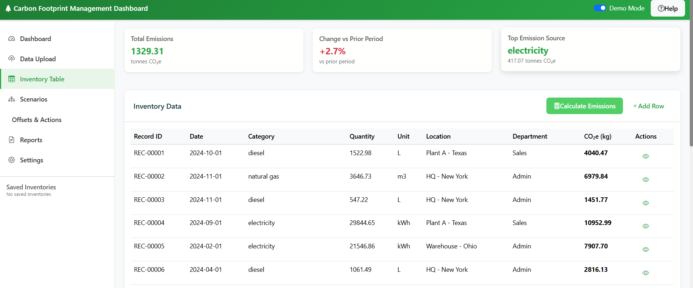
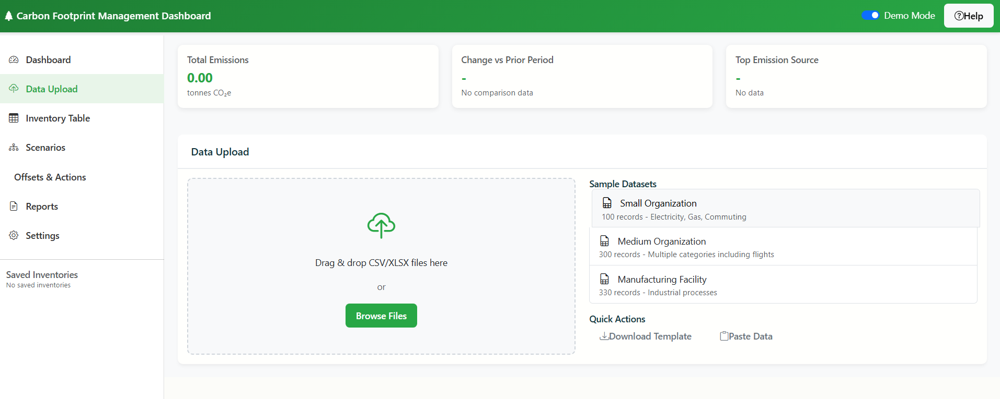

# Carbon Footprint Management Dashboard

A production-ready, browser-first web application for comprehensive carbon footprint calculation, management, and reporting following GHG Protocol standards.

---

---

## About The Project

This dashboard helps organizations measure, analyze, and manage their carbon footprint, covering energy use, transport, waste, and procurement activities. It implements GHG Protocol Scope 1, 2, and 3 calculations using a built-in, client-side emission factor engine.

Thank you for using the Carbon Footprint Management Dashboard! 🌍🚀
